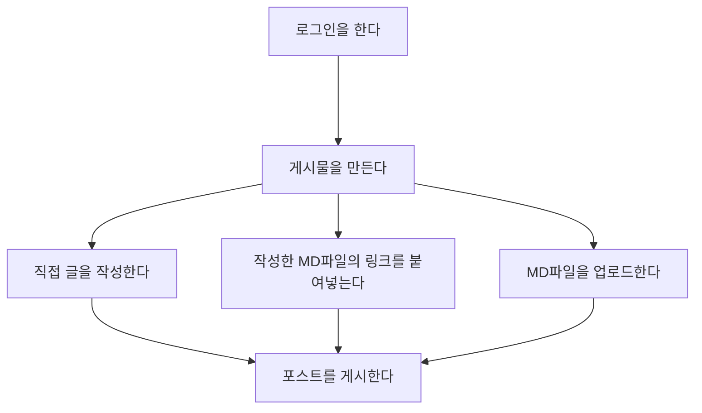

## MVP

```mermaid
flowchart TD
  A[로그인을 한다] ---> B
  B[게시물을 만든다]
  B --> C
  B --> D
  B --> E
  C[직접 글을 작성한다]
  D[작성한 MD파일의 링크를 붙여넣는다]
  E[MD파일을 업로드한다]
  C --> F
  D --> F
  E --> F
  F[포스트를 게시한다]
```